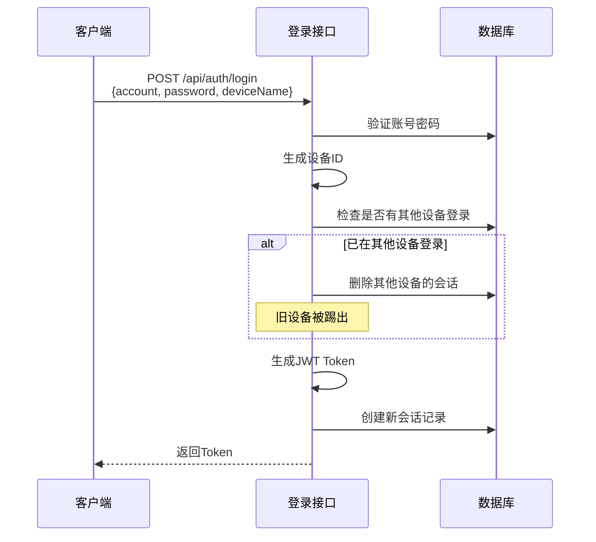

# 单点登录限制功能说明

## 功能概述

本系统实现了单点登录限制，**一个账号同一时间只能在一台设备登录**。当用户在新设备登录时，旧设备的会话会被自动踢出，需要重新登录。

## 技术实现

### 1. 数据库表结构

创建了 `active_sessions` 表来跟踪所有活跃会话：

```sql
CREATE TABLE active_sessions (
    id SERIAL PRIMARY KEY,
    user_id INTEGER NOT NULL REFERENCES users(id) ON DELETE CASCADE,
    token VARCHAR(500) NOT NULL,
    device_id VARCHAR(255),
    device_name VARCHAR(255),
    ip_address VARCHAR(50),
    user_agent VARCHAR(500),
    last_active_at TIMESTAMP DEFAULT CURRENT_TIMESTAMP,
    created_at TIMESTAMP DEFAULT CURRENT_TIMESTAMP,
    UNIQUE(user_id, device_id)
);
```

**核心字段说明**：
- `user_id`: 用户ID，关联users表
- `token`: JWT令牌
- `device_id`: 设备唯一标识（由User-Agent + IP地址生成MD5哈希）
- `device_name`: 设备名称（如"Office Word加载项"）
- `ip_address`: 登录IP地址
- `user_agent`: 浏览器/客户端标识
- `last_active_at`: 最后活跃时间（每次API调用更新）
- `created_at`: 会话创建时间

**关键约束**：
- `UNIQUE(user_id, device_id)`: 确保同一用户的同一设备只有一个会话

### 2. 设备指纹生成

设备ID通过以下信息生成：

```typescript
deviceId = MD5(User-Agent + IP地址)
```

**示例**：
- User-Agent: `Mozilla/5.0 (Windows NT 10.0; Win64; x64)...`
- IP地址: `192.168.1.100`
- 设备ID: `a1b2c3d4e5f6...` (32位MD5哈希)

### 3. 登录流程



**代码逻辑**：

```typescript
// 1. 生成设备ID
const deviceId = SessionService.generateDeviceId(userAgent, ipAddress);

// 2. 检查是否在其他设备登录
const existingSession = await SessionService.checkExistingSession(user.id, deviceId);

if (existingSession) {
  // 3. 踢出其他设备
  await SessionService.kickOtherSessions(user.id, deviceId);
}

// 4. 创建新会话
await SessionService.createSession({
  userId: user.id,
  token,
  deviceId,
  deviceName: deviceName || 'Office Word加载项',
  ipAddress,
  userAgent,
});
```

### 4. 认证中间件增强

每次API请求都会验证会话有效性：

```typescript
// 1. 验证JWT Token
const decoded = await AuthService.verifyToken(token);

// 2. 验证会话是否存在
const isValidSession = await SessionService.validateSession(decoded.userId, token);
if (!isValidSession) {
  return res.status(401).json({
    code: ResponseCode.INVALID_TOKEN,
    message: '会话已失效，请重新登录'
  });
}

// 3. 更新会话活跃时间
await SessionService.updateSessionActivity(decoded.userId, token);
```

### 5. 登出流程

用户主动登出时，会从数据库删除会话记录：

```typescript
// POST /api/auth/logout
await SessionService.deleteSession(userId, token);
```

## 核心服务函数

### SessionService 模块

位于 `src/services/session.service.ts`：

| 函数名 | 功能 | 参数 |
|--------|------|------|
| `generateDeviceId()` | 生成设备唯一标识 | userAgent, ipAddress |
| `checkExistingSession()` | 检查用户是否在其他设备登录 | userId, currentDeviceId |
| `createSession()` | 创建新会话 | {userId, token, deviceId, ...} |
| `kickOtherSessions()` | 踢出其他设备会话 | userId, currentDeviceId |
| `deleteSession()` | 删除会话（登出） | userId, token |
| `validateSession()` | 验证会话是否有效 | userId, token |
| `updateSessionActivity()` | 更新会话活跃时间 | userId, token |
| `cleanExpiredSessions()` | 清理过期会话 | 无 |
| `getUserSessions()` | 获取用户所有会话 | userId |

## 使用场景

### 场景1：正常登录

1. 用户A在设备1登录 → 创建会话1
2. 用户A在设备1继续使用 → 会话1保持活跃

### 场景2：多设备登录（自动踢出）

1. 用户A在设备1登录 → 创建会话1
2. 用户A在设备2登录 → 创建会话2，**删除会话1**
3. 设备1下次请求API → 返回401错误：`会话已失效，请重新登录`

### 场景3：主动登出

1. 用户A在设备1登录 → 创建会话1
2. 用户A点击登出 → 删除会话1
3. 设备1下次请求API → 返回401错误

### 场景4：会话过期

系统会定期清理超过7天未活跃的会话：

```typescript
// 可以设置定时任务
setInterval(async () => {
  await SessionService.cleanExpiredSessions();
}, 24 * 60 * 60 * 1000); // 每24小时清理一次
```

## 前端集成指南

### 1. 登录时传递设备名称

```javascript
const response = await fetch('/api/auth/login', {
  method: 'POST',
  headers: { 'Content-Type': 'application/json' },
  body: JSON.stringify({
    account: 'testuser',
    password: '123456',
    deviceName: 'Office Word 2024 - Windows 11' // 可选
  })
});
```

### 2. 处理会话失效错误

```javascript
async function apiCall(url, options) {
  const response = await fetch(url, {
    ...options,
    headers: {
      ...options.headers,
      'Authorization': `Bearer ${localStorage.getItem('token')}`
    }
  });
  
  if (response.status === 401) {
    const data = await response.json();
    if (data.message === '会话已失效，请重新登录') {
      // 清除本地token
      localStorage.removeItem('token');
      // 跳转到登录页
      window.location.href = '/login';
    }
  }
  
  return response;
}
```

### 3. 实现登出

```javascript
async function logout() {
  try {
    await fetch('/api/auth/logout', {
      method: 'POST',
      headers: {
        'Authorization': `Bearer ${localStorage.getItem('token')}`
      }
    });
  } finally {
    // 无论成功失败都清除本地token
    localStorage.removeItem('token');
    window.location.href = '/login';
  }
}
```

## 安全性考虑

### 1. 设备识别准确性

**当前方案**：`MD5(User-Agent + IP)`

**优点**：
- 简单高效
- 大部分场景下能准确识别设备

**局限性**：
- 动态IP场景：同一设备IP变化会被视为新设备
- 浏览器更新：User-Agent变化可能被识为新设备

**改进方案**（可选）：
- 添加客户端生成的UUID存储在localStorage
- 使用更复杂的指纹技术（如Canvas指纹）

### 2. Token安全

- JWT Token有效期：7天
- 建议在生产环境缩短为1-2天
- 敏感操作建议二次验证

### 3. 数据库性能

- `active_sessions`表通过`user_id`和`token`建立索引
- 定期清理过期会话避免数据膨胀

```sql
CREATE INDEX idx_active_sessions_user_id ON active_sessions(user_id);
CREATE INDEX idx_active_sessions_token ON active_sessions(token);
CREATE INDEX idx_active_sessions_last_active ON active_sessions(last_active_at);
```

## 测试方法

### 1. 基础功能测试

```bash
# 测试1：在设备A登录
curl -X POST http://localhost:3001/api/auth/login \
  -H "Content-Type: application/json" \
  -H "User-Agent: Device-A" \
  -d '{"account":"testuser","password":"123456","deviceName":"Device A"}'

# 保存返回的token1

# 测试2：在设备B登录（使用不同User-Agent）
curl -X POST http://localhost:3001/api/auth/login \
  -H "Content-Type: application/json" \
  -H "User-Agent: Device-B" \
  -d '{"account":"testuser","password":"123456","deviceName":"Device B"}'

# 保存返回的token2

# 测试3：使用token1访问API（应该失败）
curl -X GET http://localhost:3001/api/auth/verify \
  -H "Authorization: Bearer <token1>"

# 预期结果：401错误，提示"会话已失效，请重新登录"

# 测试4：使用token2访问API（应该成功）
curl -X GET http://localhost:3001/api/auth/verify \
  -H "Authorization: Bearer <token2>"

# 预期结果：200成功
```

### 2. 查看数据库会话

```sql
-- 查看所有活跃会话
SELECT 
  s.id,
  s.user_id,
  u.account,
  s.device_name,
  s.ip_address,
  s.device_id,
  s.last_active_at,
  s.created_at
FROM active_sessions s
JOIN users u ON s.user_id = u.id
ORDER BY s.created_at DESC;

-- 查看特定用户的会话
SELECT * FROM active_sessions WHERE user_id = 1;
```

## 配置选项

可以在环境变量中配置会话参数（未来扩展）：

```env
# 会话过期时间（天）
SESSION_EXPIRY_DAYS=7

# 是否允许多设备登录
ALLOW_MULTIPLE_DEVICES=false

# 同一用户最大会话数
MAX_SESSIONS_PER_USER=1
```

## 故障排查

### 问题1：频繁提示"会话已失效"

**可能原因**：
- 设备ID生成不稳定（IP频繁变化）
- 数据库连接问题

**解决方法**：
```sql
-- 查看该用户的会话记录
SELECT * FROM active_sessions WHERE user_id = 1;

-- 检查device_id是否频繁变化
```

### 问题2：登录后立即失效

**可能原因**：
- Token没有正确保存到数据库
- 数据库约束冲突

**解决方法**：
```typescript
// 检查日志中是否有SQL错误
console.log('Creating session for user:', userId, 'device:', deviceId);
```

## 总结

单点登录功能通过以下机制确保账号安全：

1. ✅ **设备识别**：基于User-Agent + IP生成唯一设备ID
2. ✅ **会话跟踪**：数据库记录所有活跃会话
3. ✅ **自动踢出**：新设备登录时删除旧设备会话
4. ✅ **实时验证**：每次API请求验证会话有效性
5. ✅ **活跃更新**：持续更新会话活跃时间
6. ✅ **过期清理**：定期清理7天未活跃会话

这套机制有效防止账号共享，提升系统安全性。
